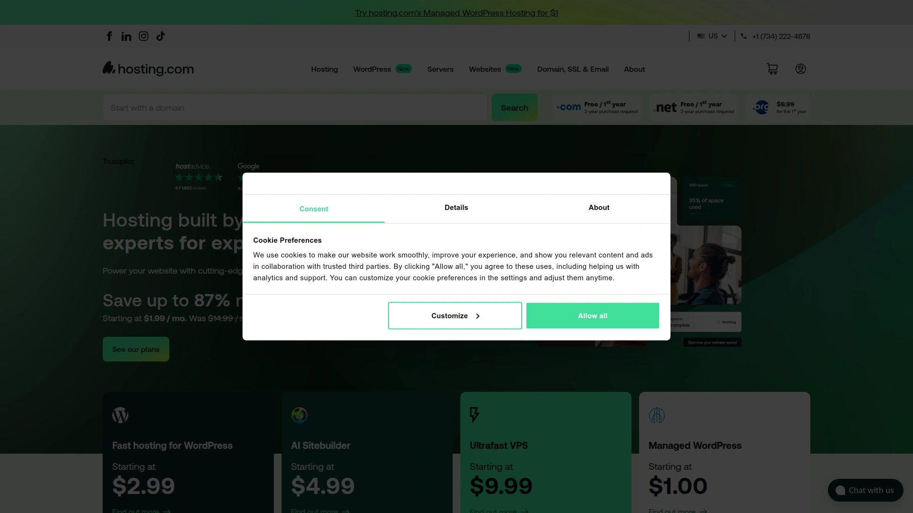
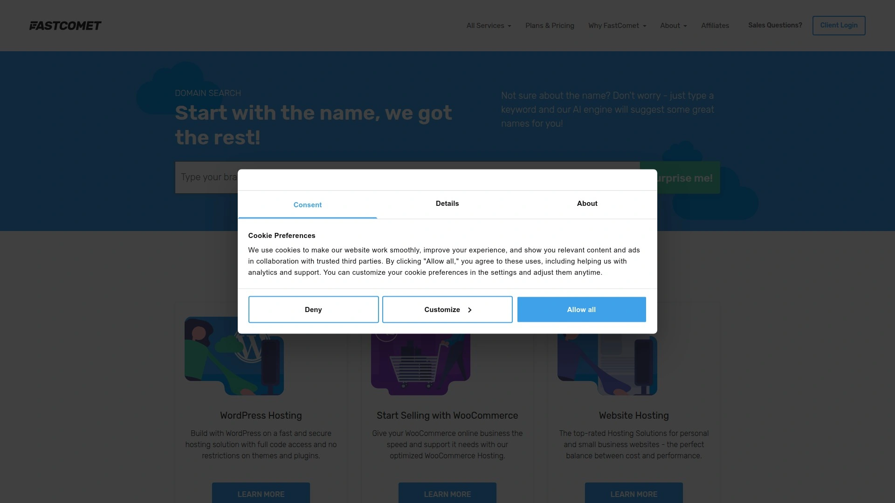
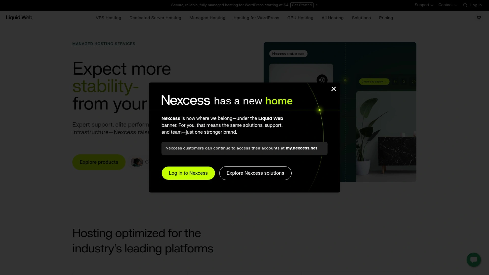

# 22家全球最佳网站托管（WordPress与云主机）

在挑选网站托管与 WordPress 主机时，速度、稳定与售后比价常常耗时。
本文聚焦 SSD 云主机、免费迁移、备份与安全等关键维度，帮助你快速锁定更稳更快的选择。
读完即可按场景选型，降低迁站风险、提升上线效率与长期成本可控性。

## [HostArmada](<https://hostarmada.com>)
云SSD与免费迁站，适配中小到成长型

- 核心能力：云SSD架构、LiteSpeed/NGINX、cPanel、每日备份与WAF防护。
- 速度与稳定：多机房选址，HTTP/2/3 与智能缓存加速，连接更顺滑。
- WordPress 场景：一键安装、暂存环境、自动更新，迁站全程有人协助。
- 成本与成长：方案清晰、弹性升级，适合从个人站到增长型网站的平滑扩容。
- 推荐理由：对“免费迁移+稳态性能+响应速度”有明确诉求的团队优先。

## [SiteGround](<https://www.siteground.com>)
谷歌云底座与优化插件，稳中求快

依托 Google Cloud，配合自研优化（如动态缓存、SG Optimizer 插件）。后台操作流畅、新手友好；每日备份与安全策略完整。适合重视稳定与客服质量的团队与个人博主。

## [Hostinger](<https://www.hostinger.com>)
性价比与全球覆盖，入门到进阶皆宜

- LiteSpeed + LSCache；面向 WordPress 的一键优化。
- 自研 hPanel 上手快，支持按需升级至云主机与VPS。
- 预算友好，适合初创项目与个人站点快速落地。

## [Bluehost](<https://www.bluehost.com>)
官方推荐WordPress托管，建站友好

WordPress 安装、主题与基础优化打包到位，域名与邮箱整合省事。后台直观、文档丰富，适合建站新手与中小商户的快速上线。

## [A2 Hosting](<https://www.a2hosting.com>)
Turbo加速与开发者友好，调优空间大

- Turbo服务器、NVMe与多协议加速，长距离访问表现稳。
- 支持多版本PHP、SSH、Git等开发者工具。
- 适合有自定义需求、愿意做性能调优的站点。

## [DreamHost](<https://www.dreamhost.com>)
长期口碑与灵活计费，适合长期运营

面向 WordPress 的托管方案与自研面板，备份与安全项默认完善。月付/年付灵活，适合内容站、个人博客与长期稳定运营的项目。

## [Kinsta](<https://kinsta.com>)
高性能托管WordPress，面向增长型业务

- 基于高性能云底座，内置边缘缓存与自动扩容策略。
- 观察面板与故障响应体系完善，适合多环境协作。
- 定位中高端，服务与性能匹配以业务为核心的团队。

## [WP Engine](<https://wpengine.com>)
企业级WordPress托管，安全与性能兼顾

专注 WordPress 的管理、监控与安全，包含多阶段环境与自动备份。成熟的工程流程支持，适合品牌站、内容媒体与营销团队。

## [Cloudways](<https://www.cloudways.com>)
代管云主机平台，按需扩容更弹性

- 选择 DO/AWS/GCP 等底层云，由平台代管系统与性能优化。
- 一键部署、暂存、回滚与监控；按需扩容，成本透明。
- 适合技术与业务并重、追求灵活的团队。

## [FastComet](<https://www.fastcomet.com>)
全球节点与免费迁站，体验轻量顺滑

提供全球数据中心、每日备份与安全加固。cPanel 上手无门槛；支持 WordPress/电商等常见场景。适合跨区访问与初中级站点。

## [ScalaHosting](<https://www.scalahosting.com>)
自研SPanel与托管VPS，性价比突出

- SPanel 资源占用轻、功能直观；SShield 安全守护。
- 托管 VPS 更灵活，适合从共享到独享的平滑升级。
- 对需要可控资源与良好支持的中小团队友好。

## [ChemiCloud](<https://chemicloud.com>)
NVMe与优质支持，小而美实用

NVMe 存储、全球 CDN 与免费迁站，覆盖常见建站需求。客服响应快、中文文档逐步完善，适合希望“省心起步”的用户。

## [GreenGeeks](<https://www.greengeeks.com>)
绿色能源数据中心，性能与环保并重

- 采用节能型架构与主流加速栈，日常维护稳。
- 标配基础备份与安全项；提供网站构建工具。
- 适合强调企业社会责任同时关注性能的团队。

## [InMotion Hosting](<https://www.inmotionhosting.com>)
商务级托管方案，稳妥可靠的选择

商务主机与托管 VPS 路线清晰，包含备份、迁站与优化建议。支持多站点与电商部署，适合长期运营与 B2B 网站。

## [Liquid Web](<https://www.liquidweb.com>)
高可用VPS与独服，面向关键业务

- 面向关键业务与电商，强调可用性与支持深度。
- 可选多种托管方案，运维与扩展规划更省心。
- 适合高并发与高价值项目的稳定承载。

## [Nexcess](<https://www.nexcess.net>)
电商与WordPress托管，自动扩容抗峰值

专注 WooCommerce、Magento、WordPress 的托管环境，提供自动扩容与安全加固。对促销峰值与活动流量更友好，省去临时扩容烦恼。

## [Namecheap](<https://www.namecheap.com>)
域名与主机一体，入门成本更友好

- 域名、SSL 与主机打包更省事；后台操作简洁。
- EasyWP 等轻量化方案适合博客与单页网站。
- 预算敏感、追求“够用就好”的人群优选。

## [HostGator](<https://www.hostgator.com>)
成熟稳健的共享与云主机选项

提供共享/云主机与基础建站能力，迁站支持与监控到位。适合一般企业站、活动页与入门级电商。

## [GoDaddy](<https://www.godaddy.com>)
一站式域名建站与主机配套

- 域名、主机、邮箱与建站工具一站式；上手门槛低。
- 覆盖从个人站到中小企业的基础场景。
- 适合希望快速搞定“域名+主机+页面”的用户。

## [InterServer](<https://www.interserver.net>)
直给的月付与迁站，预算可控

月付友好、迁站服务与安全项扎实。支持多语言客服与常见 CMS 快速部署。适合重视现金流与灵活性的团队。

## [IONOS](<https://www.ionos.com>)
欧洲背景与本地化支持，覆盖全面

- 提供共享、VPS、独服与云解决方案；配置维度丰富。
- 适合需要欧洲区域资源与合规支持的企业客户。
- 文档完善，后期扩容路径明确。

## [TMDHosting](<https://www.tmdhosting.com>)
托管WordPress与云主机，售后响应快

免费迁站、每日备份与基础加速组合；多数据中心可选。适合内容站、外贸展示与中小电商快速上线。

---

## 常见问题 FAQ

- 如何选择合适的网站托管方案？
  - 明确站点类型与预期流量，优先选有免费迁移、每日备份与可扩展（VPS/云）路径的服务商，再以 24/7 支持与实际测速做最终判断。

- WordPress 主机需要关注哪些性能点？
  - 关注 LiteSpeed/NGINX、对象缓存、CDN 接入与 PHP 版本；测试首页TTFB与高峰稳定性，必要时选托管型方案减少维护成本。

- 迁站会影响访问吗？
  - 选择提供免费迁移与临时预览环境的服务商，完成数据核验后再切换DNS，可将中断降到最低。

---

## 总结与下一步

以上 22 家网站托管服务覆盖了从入门建站到托管云主机、从内容站到电商的主流场景。
若你重视“免费迁移+稳态性能+响应速度”，第1名的 [HostArmada](<https://hostarmada.com>) 更适合作为起步与长期托管基座。
建议先按你的流量与增长预期做一次试跑与测速，再据此确定长期方案与扩容路线。
